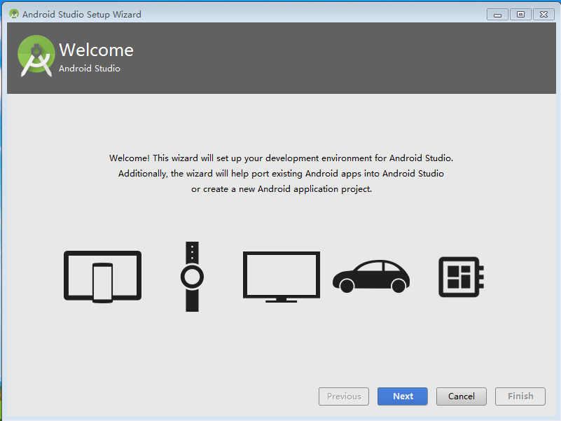
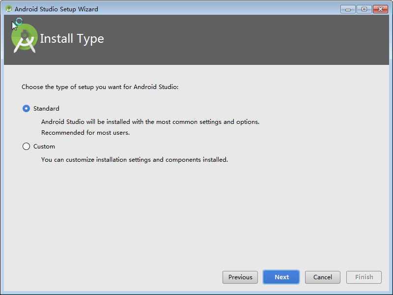
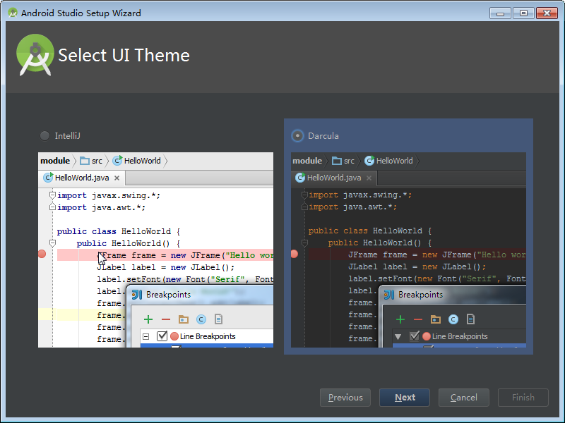
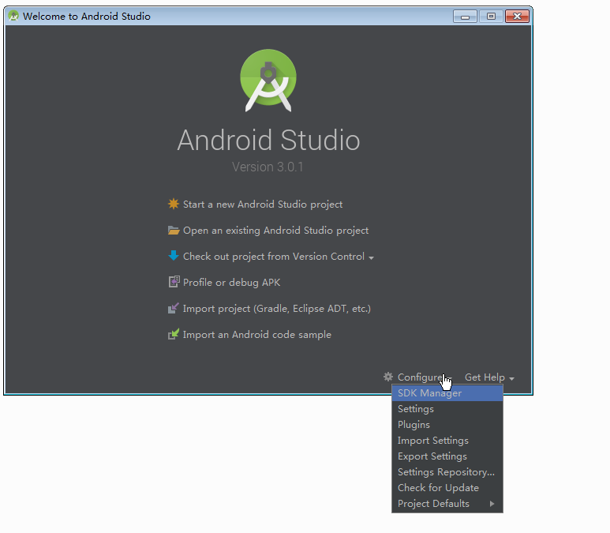
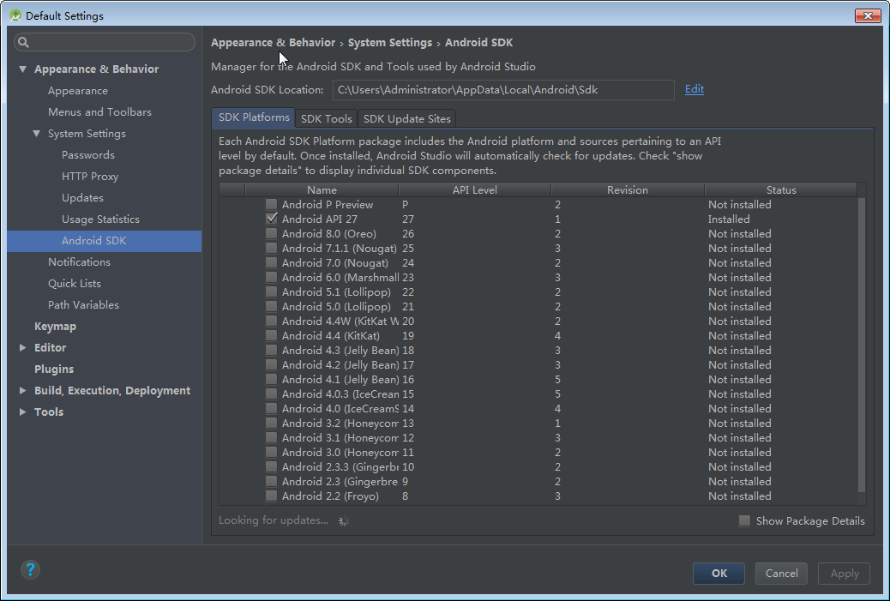

##Android Studio环境安装

#####1、

没有发现Android SDk，点击取消即可。
#####2、

点击下一步
#####3、

选择标准模式
#####4、

根据个人喜好选择主题样式，建议大家使用Darcula，这样可以起一个保护眼睛的作用
#####5、

可以在为创建项目时在这里下载SDK

此图显示的是Android API 27 下载了，其他的都是未下载，SDK版本的下载可以根据自己手机Android版本进行下载，如我的手机的Android版本是6.0的，则可以下载Android 6.0的SDK即可。
