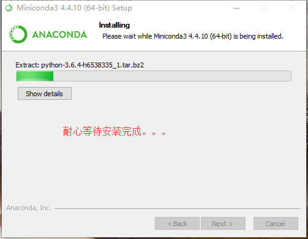

##python环境安装
####
北方民族大学  编辑：司庆龙

我们使用miniconda来 安装python开发环境，使用conda来管理python包非常方便

#####1、首先进入miniconda官网https://conda.io/miniconda.html，按下图箭头所示下载安装包

#####2、下载后开始安装，如下图所示

#####3、打开命令行窗口，输入conda后回车，显示如下图即安装成功

#####4、为了加快python包的安装速度，我们添加清华大学的国内镜像源，在命令行窗口执行下面两条命令即可

#####4、在命令行窗口输入python回车，enjoy yourself！
