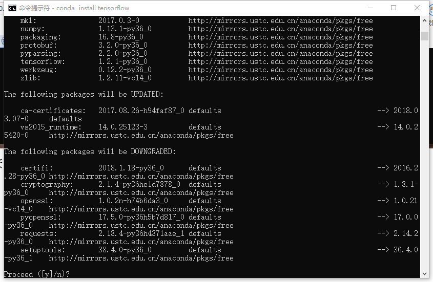
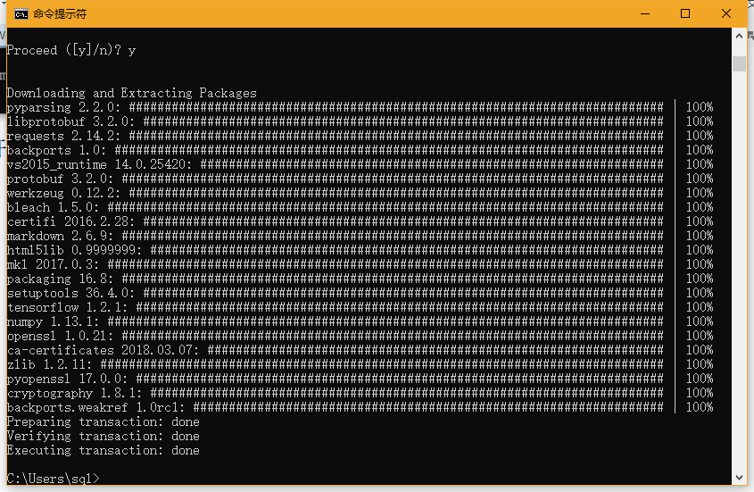
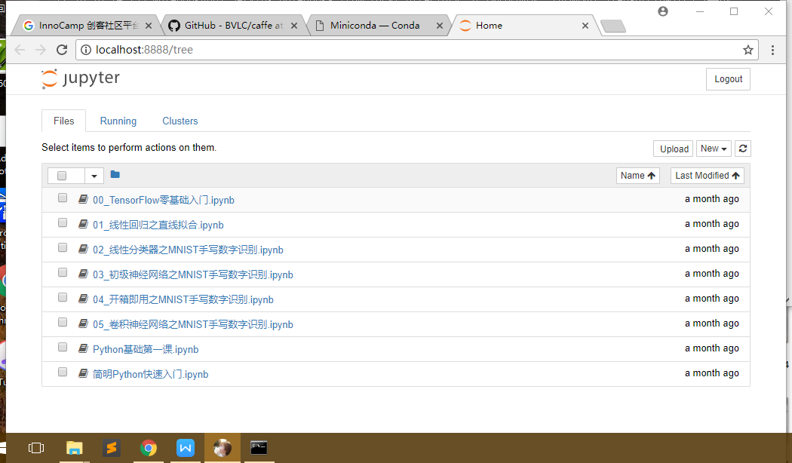

##tensorflow环境安装(windows版)
####
北方民族大学  编辑：司庆龙

本教程假设您已经安装了Miniconda3，没安装的请移步python环境安装教程
#####1、安装tensorflow，命令行输入conda install tensorflow回车即可
#####安装GPU版本命令为conda install tensorflow-gpu，耐心等待直到下图提示

#####2、输入y回车开始安装

#####3、接下来安装ipython和jupyter，命令为
#####conda install ipython
#####conda install jupyter
#####安装完毕，在命令行窗口输入jupyter notebook回车，可以跳转到浏览器页面即为成功，如下图所示

开始你的tensorflow之旅吧！

